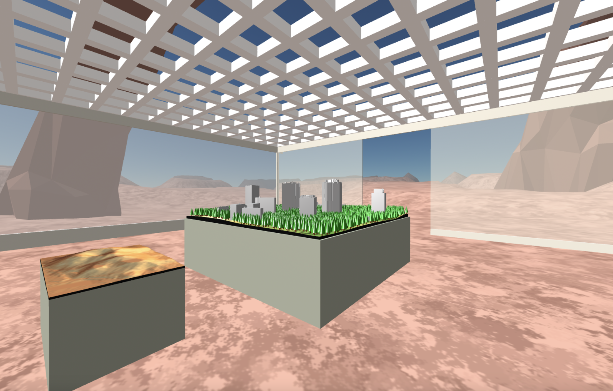

{align="right" height="138"}

# **aframeinr: Creating and Visualizing 3D Models in R and A-Frame**

<!-- badges: start -->
{alt="Lifecycle: maturing"}{alt="License: MIT"}
{alt="Project Status: Active"} {alt="CRAN Status"}
<!-- badges: end -->

## Overview

`aframeinr` is an R package designed to streamline the creation of 3D visualizations and immersive virtual reality (VR) scenes using geographic data and the A-Frame framework. This package provides a comprehensive set of tools to define areas of interest, retrieve 3D building data, visualize these buildings, and create interactive VR environments. Key features include defining spatial areas, extracting and plotting 3D building data, saving models in OBJ formats, and generating customizable VR scenes with environment settings and rotation capabilities.

## Installation

### R Package Dependencies

To install the development version of `aframeinr`:

```{r eval=FALSE}

#Install packages
install.packages(c("servr","devtools"))

#Install aframeinr from GitHub

## devtools::install_github("SCT-lab/IVE-R@new_code_structure")
```

## Usage

### Initilializing a server

As we are working with html files, it is a good idea to start a Localhost to be able to explore the HTML files without problems. By starting a server you avoid having problems importing your models into the VR environment.

```{r eval=FALSE}

library(servr)

# Start the server in the directory where your HTML files are located
servr::httd(".")

```

This function will create a server and provide an entry point. For example:

`Serving the directory /Users/my_user/Desktop/IVE-R at http://127.0.0.1:5985`

### Create an empty VR environment

The `set_VR_environment function` generates a VR environment with an A-Frame VR scene. That empty environment can be exported into an html file using the `save_VR_to_file function`. Think about this as an empty canvas where you can include your OBJ models. There are different environments and configurations that you can modify using the `environment_preset`, `skyType` and `indoor` options. You can explore different environments (e.g., forest, moon) in the [aframe-environment-component](https://www.npmjs.com/package/aframe-environment-component) page.

To build your VR environment you can use the pipe operator `%>% or |>` to concatenate the functions. To export your VR environment you need to save it using the `save_VR_to_file` function.

```{r eval=FALSE}

library(aframeinr)

# Creating empty VR environment
set_VR_environment(
  environment_preset = "forest",
  skyType = "atmosphere",indoor = TRUE) |> save_VR_to_file("empty_environment.html")

```

{width="684"}

## Adding your first model

The `add_VR_object` allows you to include `OBJ` objects into your VR environment. You can use the `scale`, `position`,`rotation`, and `adjust_to_table` functions to locate your 3D Object in the best location. For instance, when `adjust_to_table` is set to `TRUE` (default), your object is located on a table.

```{r eval=FALSE}

library(aframeinr)

# Including your first model

# Path to folder with OBJ file
obj_folder_path <- system.file("extdata", package = "aframeinr")

# Copy the file to the working directory

dir.create("test")
file.copy(obj_folder_path, "test", overwrite = TRUE,recursive = TRUE)


set_VR_environment(environment_preset = "forest",
                   skyType = "atmosphere",
                   indoor = TRUE) |> 
  add_VR_object("test/extdata/my_city.obj",
                scale = c(0.02,0.02,0.02),
                position = c(0, 1.0, 0),
                adjust_to_table = TRUE) |>
save_VR_to_file("my_city_model.html")

```

{width="684"}

## Ajusting the initial location

The `set_camera_position` allows you to adjust the initial location of the user.

```{r eval=FALSE}

library(aframeinr)

# Including your first model

set_VR_environment(environment_preset = "forest",skyType = "atmosphere",indoor = TRUE) |>
  add_VR_object("test/extdata/my_city.obj",scale = c(0.02,0.02,0.02),
                position = c(0, 1.0, 0),
                adjust_to_table = TRUE)|>
  set_camera_position(camera_position = c(0,2,5))|>
  save_VR_to_file("my_city_model_loc.html")

```

## Example Workflow

Here is an example workflow to create a VR scene with multiple models. We are going to use two models, one model using `Rayshader` and another that is already in an OBJ file.

```{r eval=FALSE}

library(rayshader)
library(aframeinr)

# Creating Simple Volcano model
filename_volcano_obj <- file.path("test","extdata","simple_volcano.obj")

volcano %>%
 sphere_shade(sunangle = 45, texture = "desert") %>%
 plot_3d(volcano, zscale = 20)

save_obj(filename_volcano_obj)

# Creating the VR environment

# Importing model
filename_city_obj <- "test/extdata/my_city.obj"

set_VR_environment(environment_preset = "arches",skyType = "atmosphere",indoor = TRUE) |>
  add_VR_object(filename_city_obj,scale = c(0.02,0.02,0.02),position = c(0, 1.0, 0)) |> 
  add_VR_object(filename_volcano_obj,scale = c(0.02,0.02,0.02),position = c(0, 0.8, 4))|>
  set_camera_position(camera_position = c(0, 1.8, 5)) |> save_VR_to_file("models_exhibition.html")


```

{width="684"}

## Contributing

Please open an issue or submit a pull request if you find any bugs or have suggestions for improvements.

## License

This package is licensed under the MIT License.

## Development Work

Development work by Sebastián Garzón and Abide Coskun-Setirek. Project managed by Will Hurst ([will.hurst\@wur.nl](mailto:will.hurst@wur.nl){.email}). The project was funded by NWO OSF project OSF23.1.004.

<p align="center">

<a href="https://www.linkedin.com/company/sct-lab"></a> <a href="https://www.wur.nl/en.htm"></a>

</p>
