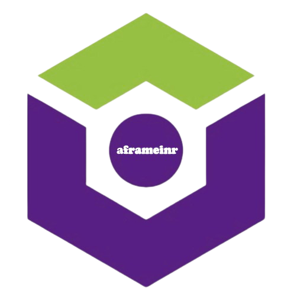
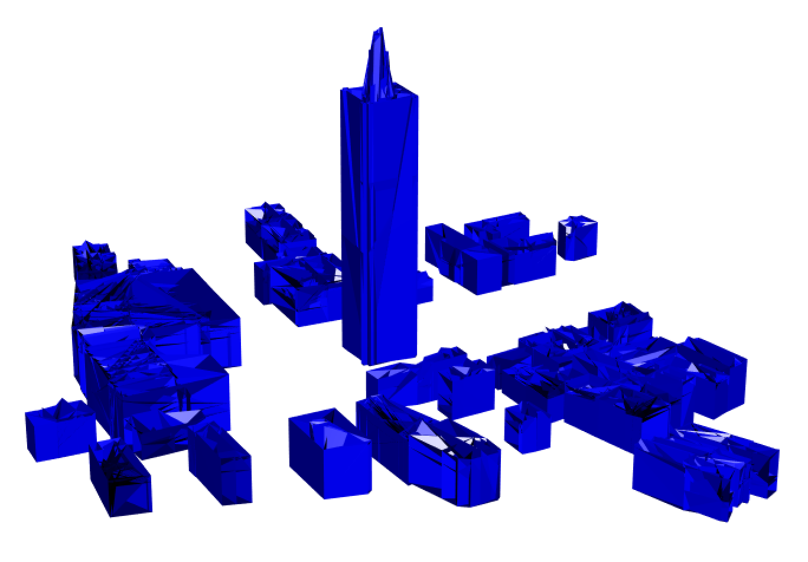
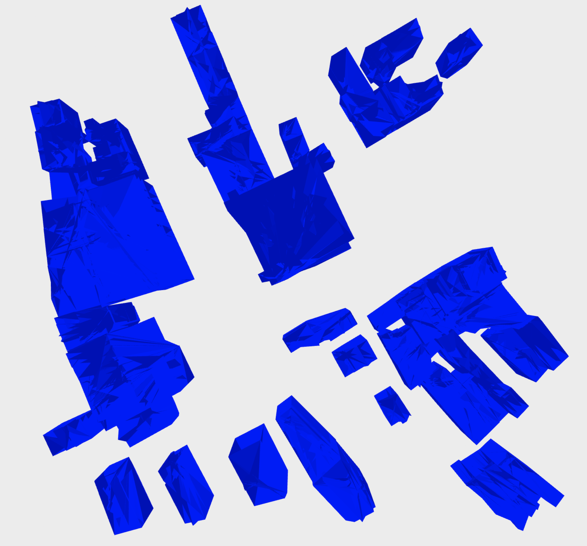
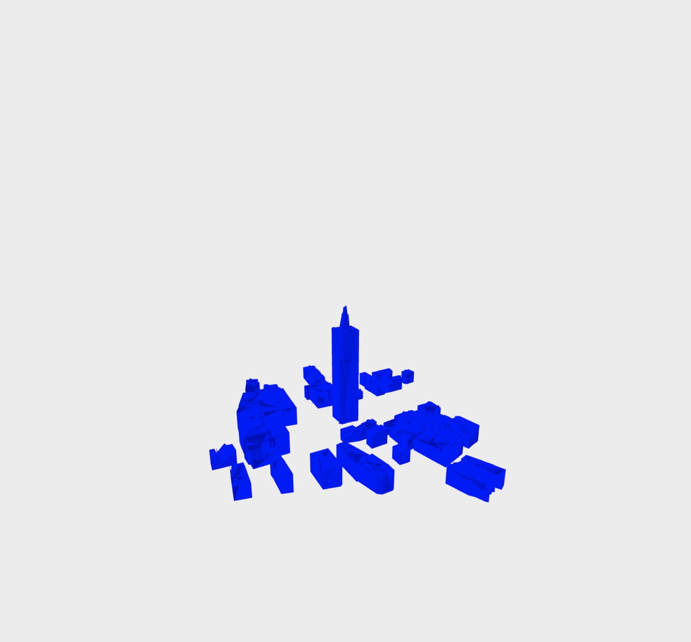
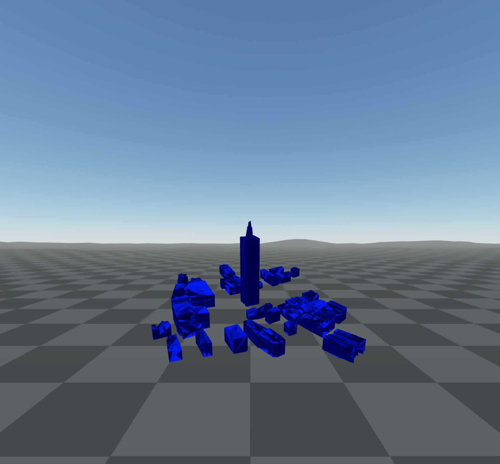
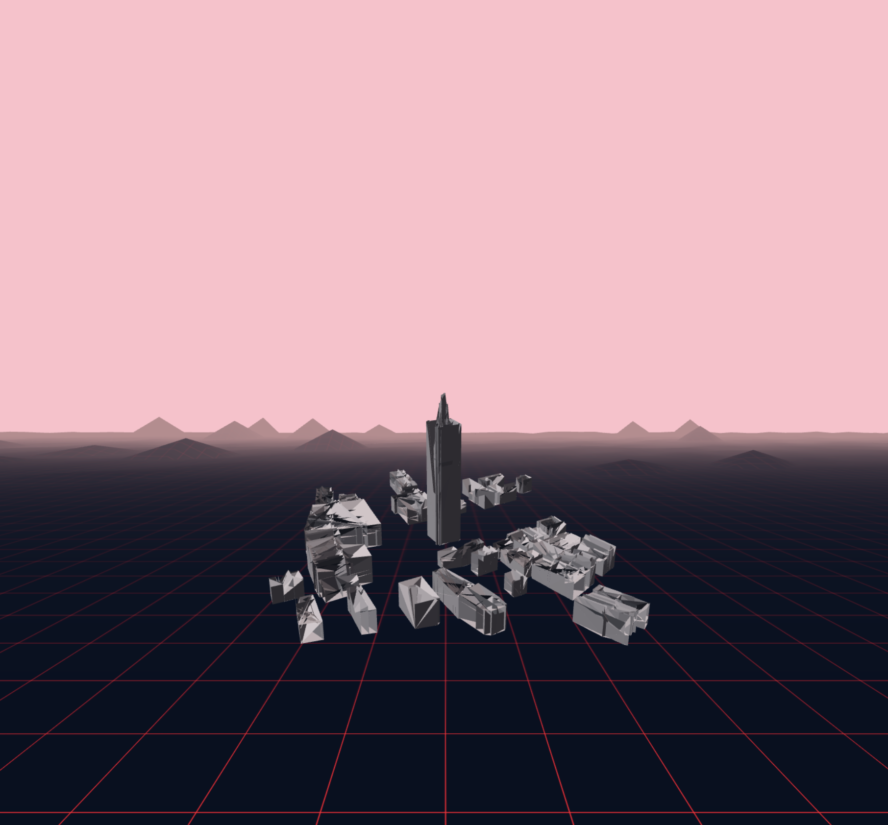
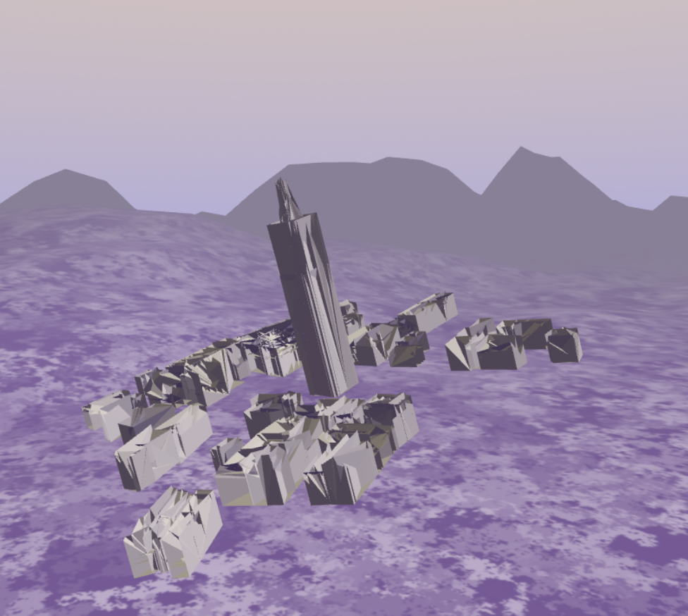

{align="right" height="138"}

# **aframeinr: Creating and Visualizing 3D Models in R and A-Frame**

|                                                                                                                                                                                                                                                                                                                                                                                                            |
|:-----------------------------------------------------------------------|
| {alt="Lifecycle: maturing"} {alt="License: MIT"} {alt="Project Status: Active"} {alt="CRAN Status"} |

## Overview

`aframeinr` is an R package designed to streamline the creation of 3D visualizations and immersive virtual reality (VR) scenes using geographic data and the A-Frame framework. This package provides a comprehensive set of tools to define areas of interest, retrieve 3D building data, visualize these buildings, and create interactive VR environments. Key features include defining spatial areas, extracting and plotting 3D building data, saving models in GLB and OBJ formats, and generating customizable VR scenes with environment settings and rotation capabilities.

## Installation

### R Package Dependencies

To install the development version of `aframeinr`:

```         
#Install packages
install.packages(c("sf", "glue","rgl", "dplyr", "httr", "units", "jsonlite"))

#Install devtools if you haven't already
install.packages("devtools")

#Install aframeinr from GitHub
##devtools::install_github("SCT-lab/IVE-R")
```

## Usage

### Define Area of Interest

The `define_aoi` function allows you to define an area of interest based on a central point and a buffer distance.

```         
library(aframeinr)

# Define area of interest
bbox=define_aoi(5.387200, 52.155170, 100)
```

### Get 3DBag Data

The `get_3Dbag_items` function retrieves 3DBag building data within the defined area of interest and returns a matrix of coordinates.

```         
# Get 3DBag building data and extract coordinates
coords=get_3Dbag_items(bbox)
```

### Plot 3DBag Buildings

The `plot_3Dbag_buildings` plots the 3D buildings within the bbox area using coordinates.

```         
# Plot 3D buildings 
plot_3Dbag_buildings(coords)
```



### Save 3D Model as GLB and OBJ

The `save_model` function saves the 3D model as GLB and OBJ files, which can be used for VR scenes.

```         
# Save 3D model as glb file with an optional color
#save_model("inst/","buildings", coords, "gray")
```

### Create VR HTML

The `create_VR function` generates an HTML file with an A-Frame VR scene using the GLB model.

```         
# Create VR HTML with the A-frame framework
`#create_VR("inst/buildings.glb", "output.html")`
```



```         
# Create VR HTML with optional parameters
create_VR("inst/buildings.glb", "output.html", position = c(0, 2.5, -3), scale = c(0.01, 0.01, 0.01), rotation = c(-75, 0, 0))
```



### Set VR Environment

The `set_VR_environment` function updates the VR HTML file to add an A-Frame environment component with specified parameters.

```         
# Set VR environment
set_VR_environment("output.html", "tron")
```



```         
# Set VR environment with optional parameters
set_VR_environment("output.html", "tron", skyType = "color", skyColor = "pink")
```



### Rotate VR Model

The `rotate_VR` function adds rotation to the GLB model in the HTML file.

```         
# Rotate only the GLB model
rotate_VR("output.html", TRUE, speed = 0.0002, clockwise = 0)
```



## Example Workflow

Here is an example workflow to create a VR scene from scratch:

```         
# Load library
library(aframeinr)

# Define area of interest
bbox=define_aoi(5.387200, 52.155170, 100)

# Get 3DBag building data and extract coordinates
coords=get_3Dbag_items(bbox)

# Plot 3D buildings
plot_3Dbag_buildings(coords)

# Save 3D model as obj and glb files with a specific color
save_model("inst/","buildings", coords, "gray")

# Create 3D model for A-frame with specific position, scale, and rotation values
create_VR("inst/buildings.glb", "output.html",c(0, 2.5, -3),c(0.01, 0.01, 0.01),c(-75,0,0))

# Set VR environment with sky type (color, gradient) and color
set_VR_environment("output.html", "tron", skyType = "color", skyColor = "pink")
#set_VR_environment("output.html", "japan", skyType = "gradient", skyColor = "#FFDD99")

# Rotate only glb models clockwise/counterclockwise with a specific speed
rotate_VR("output.html", TRUE, speed = 0.0002, clockwise = 0)
```

## Contributing

Please open an issue or submit a pull request if you find any bugs or have suggestions for improvements.

## License

This package is licensed under the MIT License.
